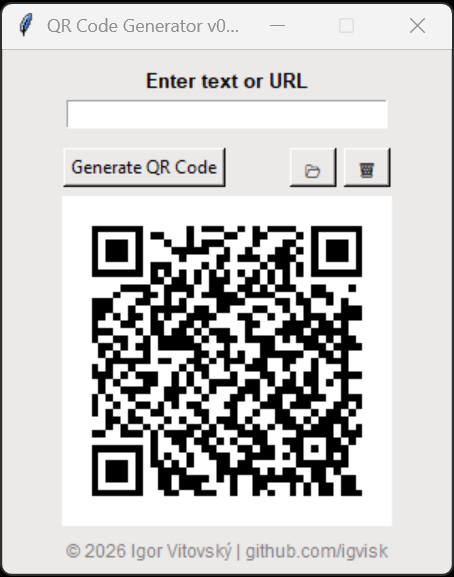

# QR Code Generator (Python)

⚠️ **Under Construction**  
This project is still actively being developed.  
Features, UI, and behavior may change at any time.

---

## 📌 About

**QR Code Generator** is a lightweight desktop application built with Python and Tkinter.  
It allows users to generate QR codes from text or URLs, copy them to the clipboard, and quickly access the generated file.

The project is intended as:
- a learning project
- a portfolio desktop application

---

## ✨ Features

- Generate QR codes from **text or URLs**
- Full **Unicode / UTF-8 support** (diacritics included)
- Fixed-size QR preview (stable UI)
- Click the QR image to **copy it to the clipboard** (Windows)
- Open the folder containing the generated QR file
- Clean Tkinter GUI with centered window layout
- Footer with a clickable GitHub link

---

## 🖼️ Preview
  


---

## 🛠 Built With

- **Python**
- **Tkinter** – GUI framework
- **pyqrcode** – QR code generation
- **Pillow (PIL)** – image processing
- **pywin32** – Windows clipboard integration

---

## 📂 Output

The generated QR code is saved as:

```
qr_code.png
```

in the same directory as the application.

---

## ⚠️ Platform Notes

- Clipboard image copy works **only on Windows**
- Requires `pywin32`
- Tested with:
  - Python 3.13

Python 3.13 support depends on the installed `pywin32` build.  
If issues occur, Python 3.12 is recommended.

---

## 📜 Licenses & Third-Party Software

This project uses the following open-source libraries:

### pyqrcode
- License: **MIT License**
- Copyright © 2013 Michael Hershey

### Pillow (PIL)
- License: **PIL Software License** (BSD-style)

### pywin32
- License: **Python Software Foundation License (PSF)**

All third-party libraries remain the property of their respective authors.  
This project does **not** claim ownership over any third-party code.

---

## 📜 License

This project is licensed under the **MIT License**.

The MIT License applies **only to the original source code of this project**.  
Third-party libraries are distributed under their respective licenses and remain the property of their original authors.

See the `LICENSE` file for full license text.

---

## © Copyright

© 2026 Igor Vitovský

---

## 🔗 Author

**Igor Vitovský**  
GitHub: https://github.com/igvisk
