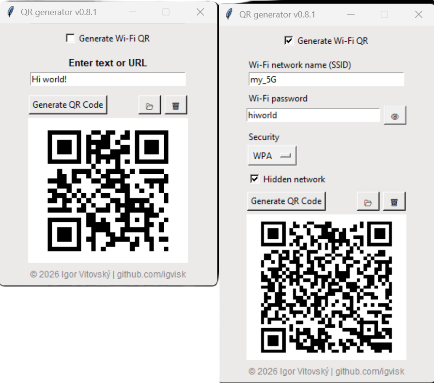

# QRgenerator

QRgenerator is a lightweight Windows desktop app built with Python and Tkinter for creating QR codes from plain text, URLs, and Wi-Fi credentials.

Current application version: `v0.8.1`

## Features

- Generate QR codes from text and URLs
- Generate Wi-Fi QR codes for `WPA` and `Open` networks
- Optional hidden network flag for Wi-Fi payloads
- UTF-8 QR generation for Unicode text
- Fixed-size QR preview inside the app window
- Click the QR preview to copy it to the Windows clipboard
- Open the generated file directly in Windows Explorer
- Clear the current QR preview and reset the active form
- Simple centered Tkinter interface with a clickable GitHub footer link

## Preview



## Requirements

- Python 3
- Tkinter
- `pyqrcode`
- `pypng`
- `Pillow`
- `pywin32`

Install dependencies with:

```bash
pip install pyqrcode pypng pillow pywin32
```

`pypng` is required for PNG export used by `pyqrcode`.

## Run

```bash
python QRgenerator.py
```

## Usage

1. Leave `Generate Wi-Fi QR` unchecked to create a QR code from text or a URL.
2. Enable `Generate Wi-Fi QR` to switch to Wi-Fi mode.
3. In Wi-Fi mode, enter the SSID, choose security type, and optionally mark the network as hidden.
4. Click `Generate QR Code` to create and preview the QR code.
5. Click the QR image to copy it to the clipboard.
6. Use the folder button to reveal the generated file in Explorer.
7. Use the clear button to reset the current mode and remove the preview.

## Output

The generated QR code is saved as:

```text
qr_code.png
```

The file is created in the same directory as `QRgenerator.py` and is overwritten each time a new QR code is generated.

## Platform Notes

- The current implementation is Windows-focused.
- Clipboard image copy depends on `pywin32`.
- Opening the generated file location uses Windows Explorer.

## Author

Igor Vitovsky  
GitHub: https://github.com/igvisk
